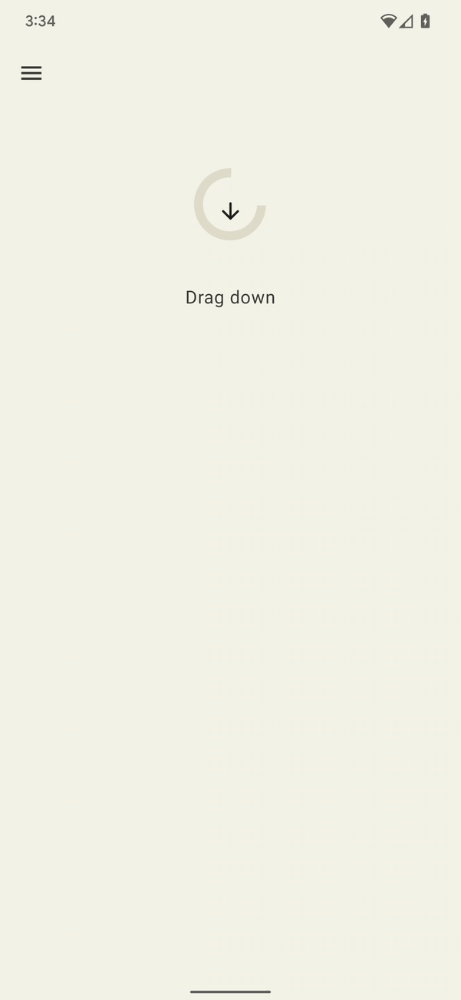
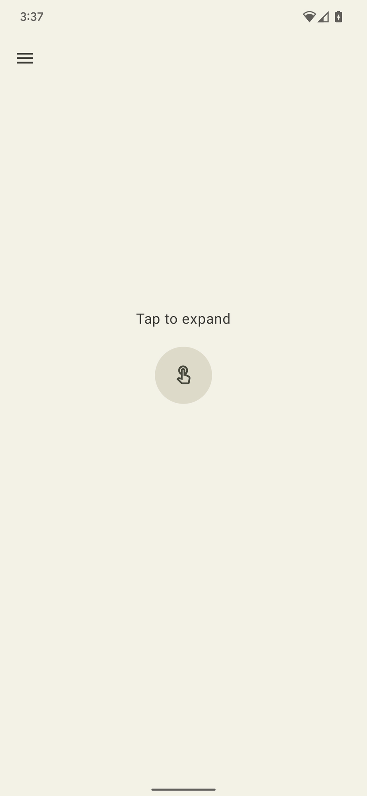
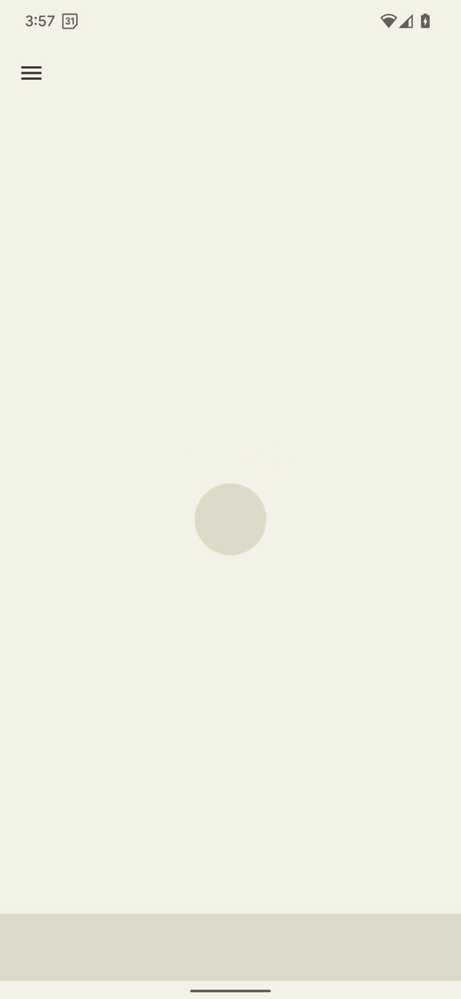
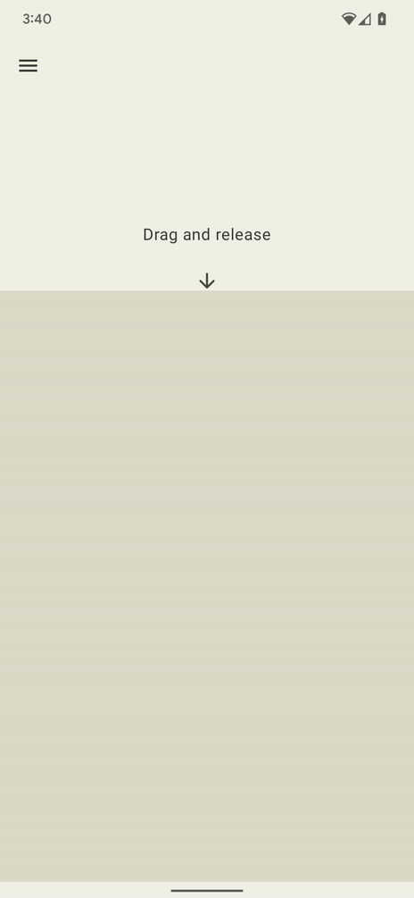

Haptic Sampler
===========================

## Introduction

Android provides wide access to the device vibrator hardware so you can play different
vibration effects and patterns from your app. Haptics can enrich your app experience by attracting
the user's attention when it’s required, providing useful feedback to their interactions and
augmenting audio-visual content with tactile sensations.

## Examples

The Haptic Sampler application has 4 examples showcasing some of the latest primitives available in the Android framework.

<h2 class="example-header">Resist</h2>

  
  

<h2 class="example-header">Expand</h2>

  
  

<h2 class="example-header">Bounce</h2>

  
  

<h2 class="example-header">Wobble</h2>

  
  

